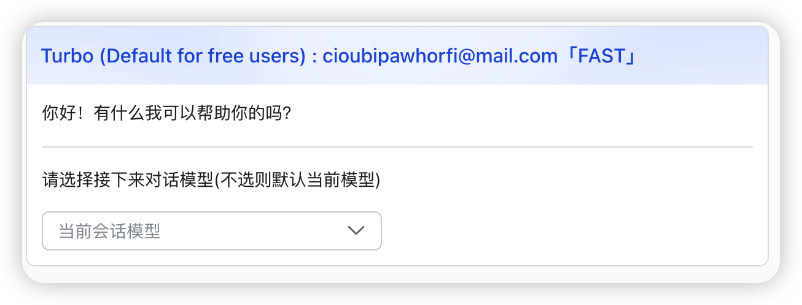

​ 该应用通过配置的账号和密码进行登录，通过接口查询账号的付费类型(是否为plus账号)
，该应用基于accesstoken方式，所以对话是免费的。对于token会过期的情况，该应用会通过每周定时任务，和请求时token过期重新登录刷新token。同时定时任务来查询配置账号的付费类型来尽量保证系统可用性。

搭建成功后，默认使用3.5的模型进行服务，如果配置了plus账号，优先使用plus账号的3.5模型进行服务。

服务方式分为fast模式和keep模式

## keep模式

​ 优先保证具有上下文的能力下响应你的提问

## fast模式

​ 优先响应你的提问，因为一个账号同时只能回复一个提问，所以对于快速多个提问该账号无法继续提供服务，或者你会话上下文使用的账号被另一个用户正在使用，则该账号也无法提供服务，所以fast模式通过切换账号进行服务，就无法保证上下文能力。

fast模式和keep模式通过向机器人发送/fast或者/keep指令进行切换

默认使用keep模式

机器人回复消息卡片格式消息分为三个部分，最上方为标题部分，中间为gpt响应的内容，选择框是对模型的切换

## 标题部分

构成由 模型 + 账号 + (账号类型) + 服务模式构成

其中账号类型只有在plus账号服务时才会显示plus标识

服务模式为fast或者keep模式

## 下拉选择框部分

​ 下拉框的选项由账号池里账号类型自动配置，账号池里有plus账号，则自动加入plus账号支持的模型

* 通过下拉框选择模型进行模型的切换，同时会从账号池里随机一个账号来进行服务，所以有概率会切换服务账号
* 通过选择 **使用当前上下文**，进行会话的选择，例如你切换了会话的模型或者账号后，你又想得到之前某次对话的上下文，通过选择该选项，使得你与机器人的会话重新恢复到之前对话的上下文环境。
